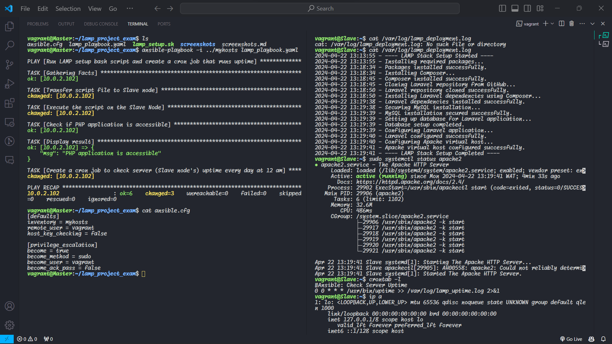
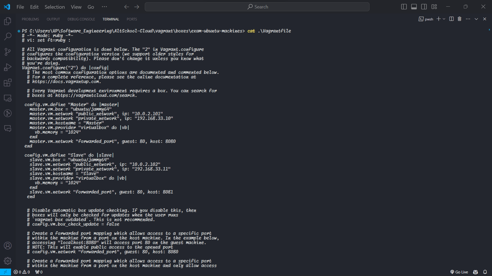

# Screenshots

### Screenshot of Ansible Playbook running and showing the accessibility of the slave's IP address on the Master node(left) and newly created lamp deployment progress log file on the Slave node (right)

### Screenshot of Apache running on Slave Node, newly created cronjob and ip address details (right terminal)

### Proof of Laravel's accessibility through the Slave node's IP address

### Screenshot of custom ansible.cfg file on Master node (left terminal)

### Screenshot of Vagrantfile configurations

